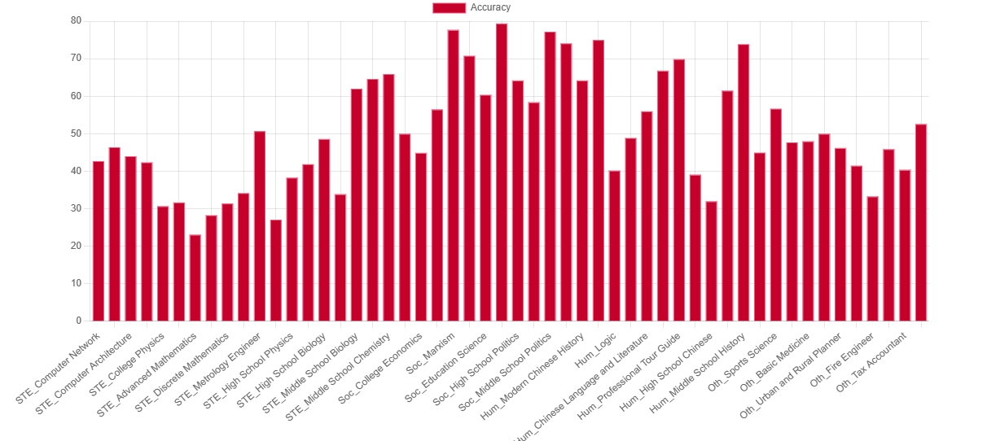
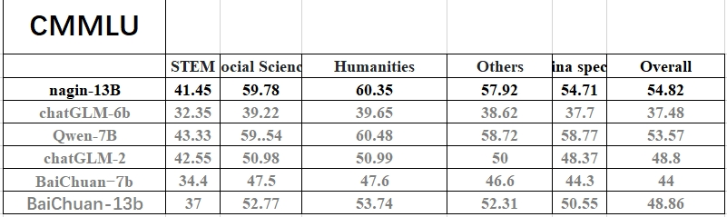
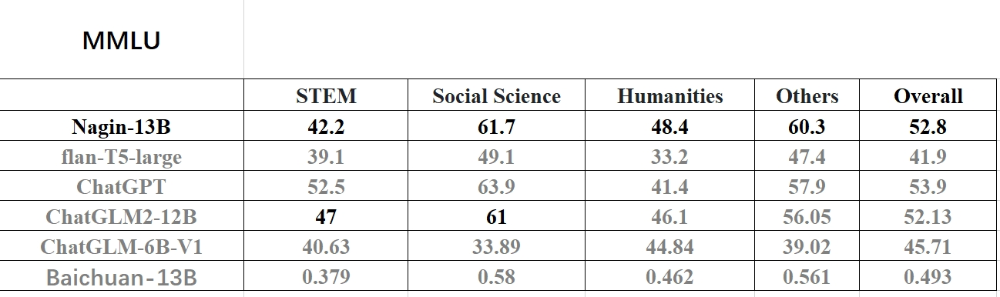

# nagin-13b
## 结构
我们发布的nagin-13B采用改进的transformer结构，通过在2T左右的图书数据上我们进行了早期阶段的重新预训练。

## 第二阶段微调
在2000w条sft数据集（包括开源和自收集）上进行了第二阶段的微调训练，最后，针对推理能力和数学能力不足的问题，

## 教育题库数据微调
我们收集了大概50w条包括c-eval，gaokao，cmmlu，mmlu，信通院测试数据样例以及部分开放教育题库在内的题库数据上，进行了第三阶段的打榜微调训练，模型将于近期整理开源到modelspace或huggingface。

## 评测
我们评估了不同数量的instruction tuning数据，对模型效果的影响。总的来说，提升数据量能持续带来效果的提升，但是在不同类型的任务上表现有所不同。在Extract, Classification, Closed QA, 和Summarization任务上，增加数据能持续带来效果的提升，还未达到瓶颈。在一些任务上，还需要进一步的提升和数据量扩充。

Cmmlu上的效果

mmlu上的效果

## 局限性和使用限制
基于当前数据和基础模型训练得到的SFT模型，在效果上仍存在以下问题：

在涉及事实性的指令上可能会产生违背事实的错误回答。

对于具备危害性的指令无法很好的鉴别，由此会产生危害性言论。

在一些涉及推理、代码等场景下模型的能力仍有待提高。

基于以上模型局限性，我们要求开发者仅将我们开源的代码、数据、模型及后续用此项目生成的衍生物用于研究目的，不得用于商业，以及其他会对社会带来危害的用途。

## 其他
此外，目前结合了工信部AIGC可信标准，正在收集更多价值观、偏见、种族歧视数据指令进行第四阶段的训练，以此增加了模型的安全输出控制。
